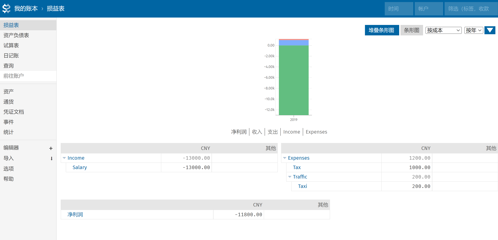
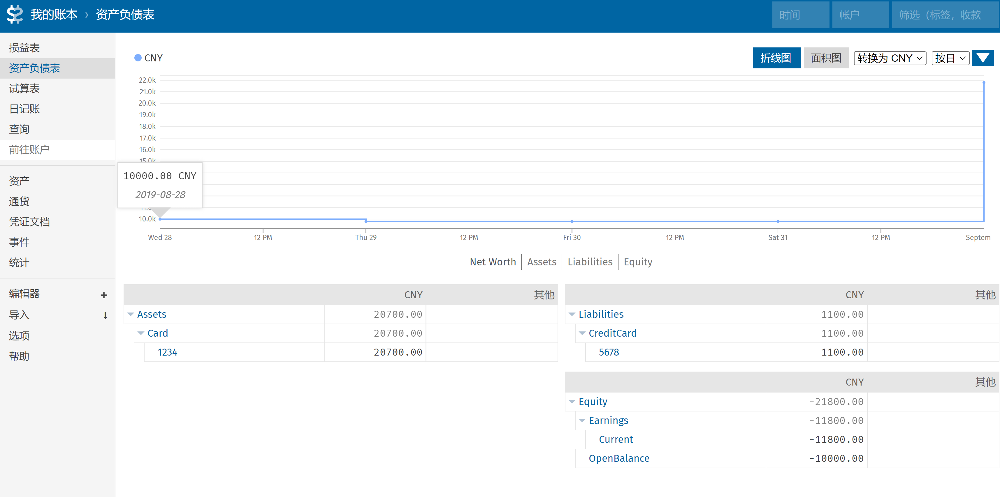

介绍记账方法和记账工具。

## 为什么记账

记账的目的是让自己了解个人的财务状况，知道自己有多少资产，资产分布在哪些账户，同时也了解自己有多少负债；另外是了解自己每月有哪些收入和收入来源，每月消费、钱都花在了什么地方。

为了实现这个目的，需要记账，维护一个账本，通过账本生成财务报表，来分析自己的财物状况。

其中常用的财务报表是 损益表 （income statement）和 资产负债表（balance sheet）。通过资产负债表可以清楚的知道自己的资产和负债。通过损益表可以对自己钱的来源和去处一目了然。

## 记账方法

在记账方法上，只记录收支的方法叫做普通记账，也就是流水账。

另外一种记账方法叫做复式记账，除了记录收支，还记录每笔交易的资金流动，账户变化情况。

在复式记账方法里面，一笔交易可能会涉及2个以上的账户，账户的金额有正有负，一般支出为正，收入为负，正负相等，这便是复式记账的原理，叫做会计恒等式。

会计恒等式的表述如下：

(Assets + Expenses) + (Liabilities + Income) + Equity = 0

PS: 如果去查会计恒等式词条，会发现解释看不明白。

在复式记账中，有五个基本账户，在这五个账户里面又可以细分很多其他账户，具体如下：

- 资产 Assets -- 现金、银行存款、房、车等；可正可负，正数表示有钱存入，余额增加；负数表示有钱转出，余额减少。
- 负债 Liabilities -- 信用卡、花呗、白条、房贷、车贷等；可正可负，正数表示还款，负债减少；负数表示借款，负债增加。
- 收入 Income -- 工资、奖金等。一般为负数，表示收入多少钱，投资收入账户可能出现正数，则表示投资亏损。
- 费用 Expenses -- 衣食住行消费，个税，投资等。一般为正数，表示花费多少钱。
- 权益 Equity -- 在开始记账之前已有的资金，账户初始化、误差处理等场合使用。一般为负数。

## 记账工具

- Beancount：python 写的一个复式记账工具，账本使用纯文本按一定格式记录。
- fava：Beancount 的一个 Web 界面，用来查看财务报表。
- vscode 和 Beancount 插件:文本编辑器，用来编辑账本。
- git: 对账本进行版本管理。
- git crypt: git 仓库加密插件，用来加密账本数据。

## 使用方法

1. 安装 beancount fava

   需要python 环境，分别安装 beancount和fava

   ```bash
   pip install beancount fava
   ```

2. 创建账本

   beancount 账本使用文本文件，记账需要按照beancount的语法编写。一般账本文件的后缀为`.bean`。

   在创建账本之前，使用git初始化一个仓库，并配置好git crypt，对仓库进行加密，使用GitHub、gitee 等代码托管平台托管账本数据，鉴于账本数据比较敏感采用git crypt对仓库进行加密。

   账本示例 moneybook.bean：

   ```
   ;【一、账本信息】
   option "title" "我的账本" ;账本名称
   option "operating_currency" "CNY" ;账本主货币
   
   ;【二、账户设置】
   ;1、开设账户
   1990-01-01 open Assets:Card:1234 CNY, USD ;尾号1234的银行卡，支持CNY和USD
   1990-01-01 open Liabilities:CreditCard:5678 CNY, USD ;双币信用卡
   1990-01-01 open Income:Salary CNY ;工资收入
   1990-01-01 open Expenses:Tax CNY ;交税
   1990-01-01 open Expenses:Traffic:Taxi CNY ;打车消费，只支持CNY
   1990-01-01 open Equity:OpenBalance ;用于账户初始化，支持任意货币
   
   ;2、账户初始化
   2019-08-27 * "" "银行卡，初始余额10000元"
       Assets:Card:1234           10000.00 CNY
       Equity:OpenBalance        -10000.00 CNY
   
   ;【三、交易记录】
   2019-08-28 * "杭州出租车公司" "打车到公司，银行卡支付"
       Expenses:Traffic:Taxi        200.00 CNY
       Assets:Card:1234            -200.00 CNY
   
   2019-08-29 * "" "餐饮"
       Assets:Card:1234           -1100.00 CNY
       Liabilities:CreditCard:5678 1100.00 CNY
       
   2019-08-31 * "XX公司" "工资收入"
       Assets:Card:1234           12000.00 CNY
       Expenses:Tax                1000.00 CNY
       Income:Salary           
   ```

   Beancount 账本记账主要包含三个部分

   - 账本信息：设置账本名称，账本主货币。
   - 账户设置：开设账户，关闭账户和账户初始化。
   - 交易记录：日常收支记录。

3. 查看报表

   执行命令 `fava moneybook.bean`，在浏览器打开 http://127.0.0.1:5000  查看账本

   

   

   

   

   


## 参考文章

- 记账神器 Beancount 教程 https://sspai.com/post/59777
- 